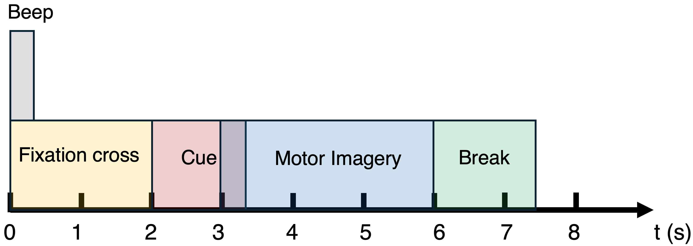

# EEGLAB Tutorial  
Last edited: May 2021  

This is a demonstration of how to use EEGLAB with the public dataset **BCI Competition IV-2a**.  

The BCI competition IV-IIa dataset provided by the Lab- oratory of Brain-Computer Interfaces at Graz University of Technology was used to evaluate the performance of the proposed framework. Briefly, this dataset was collected from nine right-handed subjects (A01-A09) using a 22-Ag/AgCl electrode EEG at the sampling rate of 250 Hz. The dataset includes data for left and right hand MI tasks (72 trials per task per subject).

  
  